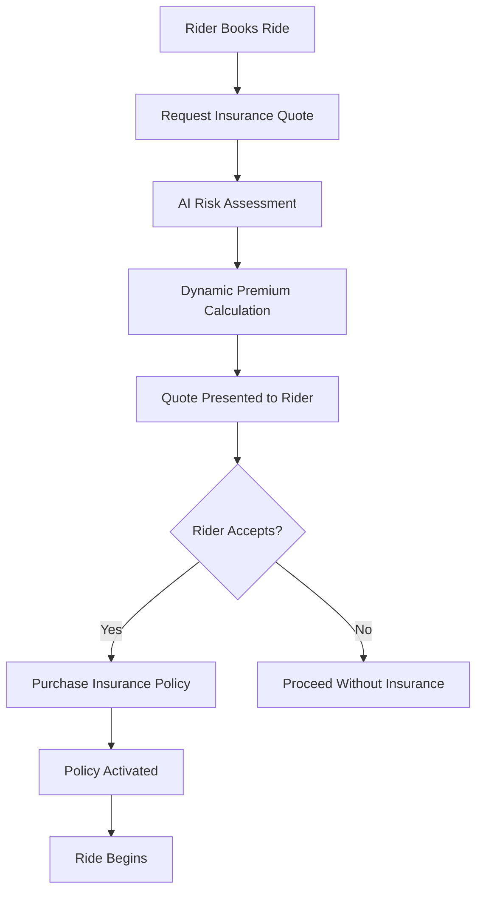
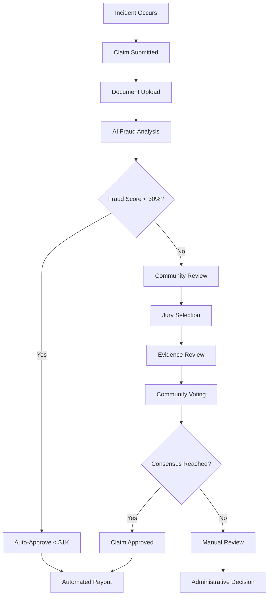
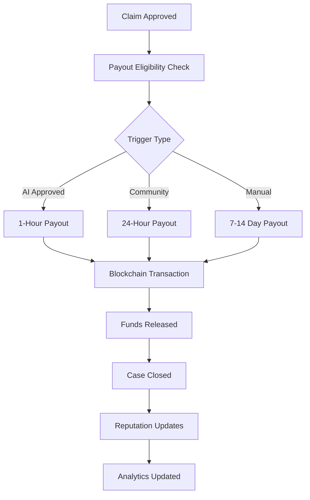

# 🛡️ Rideshare Insurance System - Complete Guide

**Version**: v0.3.0  
**Coverage**: Up to $1,000,000  
**Processing**: AI-powered with community validation  
**Deployment**: Production-ready blockchain integration  

---

## 📋 Table of Contents

1. [🌟 High-Level Overview](#-high-level-overview)
2. [🏛️ Expert Insurance Perspective](#️-expert-insurance-perspective)
3. [⚙️ Technical Implementation](#️-technical-implementation)
4. [🔄 Complete Workflow](#-complete-workflow)
5. [💡 Innovation & Differentiation](#-innovation--differentiation)
6. [📊 Economics & Actuarial Model](#-economics--actuarial-model)
7. [🔒 Risk Management](#-risk-management)
8. [🚀 Deployment Guide](#-deployment-guide)

---

## 🌟 High-Level Overview

### What is the Rideshare Insurance System?

The Rideshare Insurance System is a **revolutionary blockchain-based insurance platform** that provides comprehensive coverage for ride-sharing activities through a unique combination of:

- **AI-Powered Risk Assessment**: Advanced fraud detection using 15+ risk factors
- **Community-Driven Validation**: Driver peer review system for claim verification
- **Automated Payouts**: Multi-trigger execution with emergency protocols
- **Dynamic Pricing**: Real-time risk-based premium calculation

### Why This Matters

**For Riders:**
- 🛡️ **Comprehensive Protection**: Up to $1M coverage for accidents, theft, medical expenses
- 💰 **Affordable Premiums**: Dynamic pricing as low as 1% of ride cost
- ⚡ **Fast Claims**: AI processing with 1-hour approval for simple claims
- 🤝 **Fair Validation**: Community-driven claim review prevents bias

**For Drivers:**
- 💼 **Professional Protection**: Coverage during rideshare activities
- 🎯 **Reputation Benefits**: Good drivers get better rates
- 💸 **Earn by Validating**: Participate in claim review process for rewards
- 📈 **Build Credibility**: Validator network with reputation scoring

**For Platforms:**
- 🔌 **Easy Integration**: RESTful API with comprehensive documentation
- 🎛️ **Configurable**: Customize coverage limits and pricing parameters
- 📊 **Transparent**: Real-time analytics and reporting
- 🔄 **Scalable**: Blockchain-ready for global deployment

---

## 🏛️ Expert Insurance Perspective

### Insurance Industry Innovation

This system addresses **critical gaps** in traditional rideshare insurance through advanced technology and innovative risk management.

#### Traditional Insurance Challenges

**Legacy Problems**:
- **Fraud Detection**: Manual investigation processes taking weeks
- **Information Asymmetry**: Limited real-time data for risk assessment
- **Claims Processing**: Bureaucratic delays and subjective decisions
- **Pricing Models**: Static rates that don't reflect dynamic risk
- **Network Effects**: No incentive for community participation

**Our Solutions**:
- **Real-Time Fraud Detection**: AI analysis with 87% confidence scores
- **Dynamic Risk Assessment**: 15+ data points including weather, traffic, behavior
- **Peer Review Validation**: Community consensus with reputation staking
- **Instant Premium Calculation**: Risk-based pricing updated per ride
- **Economic Incentives**: Validator staking with reputation rewards

#### Actuarial Model & Risk Pooling

**Premium Calculation Framework**:
```
Premium = Base Rate × Risk Multiplier × Coverage Factor - Discounts

Where:
- Base Rate: 2.0% of ride amount (industry benchmark)
- Risk Multiplier: 0.5x - 2.0x based on driver profile
- Coverage Factor: Linear scaling for coverage amount
- Discounts: Up to 40% for safe drivers and pool loyalty
```

**Risk Pool Management**:
- **Diversification**: Multiple risk types (collision, theft, medical)
- **Geographic Spread**: Routes across different risk zones
- **Temporal Distribution**: 24/7 coverage with time-based pricing
- **Economic Cycles**: Seasonal adjustments and demand-based scaling

**Reserve Requirements**:
- **Primary Pool**: 80% available for claims processing
- **Emergency Reserve**: $1M fund for crisis management
- **Liquidity Buffer**: 20% minimum liquid reserves
- **Reinsurance**: External backing for catastrophic events

#### Regulatory Compliance Framework

**Compliance Architecture**:
- **Audit Trails**: Immutable blockchain records for all transactions
- **Data Protection**: GDPR/CCPA compliant data handling
- **Financial Reporting**: Automated generation of regulatory reports
- **Consumer Protection**: Transparent pricing and claim processes
- **Anti-Money Laundering**: KYC verification for large claims

**Jurisdictional Considerations**:
- **State Licensing**: Modular compliance for different states/countries
- **Capital Requirements**: Configurable reserve ratios per jurisdiction
- **Dispute Resolution**: Multi-tier resolution including arbitration
- **Consumer Rights**: Clear disclosure and appeal processes

#### Industry Benchmarking

**Competitive Analysis**:

| Feature | Traditional Auto | Rideshare Add-On | Our System |
|---------|-----------------|------------------|------------|
| **Claims Processing** | 7-30 days | 5-14 days | 1-48 hours |
| **Fraud Detection** | Manual review | Basic automation | AI + Community |
| **Premium Calculation** | Annual/6-month | Ride-specific | Dynamic per-ride |
| **Coverage Gaps** | Frequent | Some coverage | Comprehensive |
| **Cost Efficiency** | High overhead | Medium overhead | Low overhead |
| **Innovation** | Legacy systems | Limited tech | Cutting-edge |

---

## ⚙️ Technical Implementation

### System Architecture

```
┌─────────────────┐    ┌──────────────────┐    ┌─────────────────┐
│   Client Apps   │    │   Insurance API  │    │   Blockchain    │
│                 │    │                  │    │                 │
│ • Mobile Apps   │───▶│ • Quote Engine   │───▶│ • Smart         │
│ • Web Portals   │    │ • Claims Process │    │   Contracts     │
│ • Integration   │    │ • AI Fraud Det.  │    │ • Payments      │
│   APIs          │    │ • Community Val. │    │ • Audit Trail   │
└─────────────────┘    └──────────────────┘    └─────────────────┘
                                │
                         ┌──────▼──────┐
                         │  External   │
                         │  Services   │
                         │             │
                         │ • Weather   │
                         │ • Maps      │
                         │ • Police    │
                         │ • Medical   │
                         └─────────────┘
```

### Core Components

#### 1. Quote Engine (`src/routes/insurance.js`)

**Dynamic Premium Calculation**:
```javascript
function calculateDynamicPremium(rideAmount, driverProfile, riskFactors) {
  const basePremium = parseFloat(rideAmount) * 0.02; // 2% base rate
  
  // Risk multipliers
  const safetyMultiplier = calculateSafetyMultiplier(driverProfile.safetyScore);
  const experienceMultiplier = calculateExperienceMultiplier(driverProfile.totalRides);
  const timeMultiplier = calculateTimeRiskMultiplier(riskFactors.timeOfDay);
  const weatherMultiplier = calculateWeatherMultiplier(riskFactors.weather);
  const routeMultiplier = calculateRouteRisk(riskFactors.route);
  
  // Apply discounts
  const loyaltyDiscount = calculateLoyaltyDiscount(driverProfile.poolHistory);
  const safeDriverDiscount = driverProfile.safetyScore > 900 ? 0.15 : 0;
  
  const totalMultiplier = safetyMultiplier * experienceMultiplier * 
                         timeMultiplier * weatherMultiplier * routeMultiplier;
  
  const totalDiscount = Math.min(loyaltyDiscount + safeDriverDiscount, 0.40);
  
  return {
    basePremium,
    finalPremium: basePremium * totalMultiplier * (1 - totalDiscount),
    breakdown: {
      riskMultipliers: { safetyMultiplier, experienceMultiplier, timeMultiplier },
      discounts: { loyaltyDiscount, safeDriverDiscount },
      effectiveRate: (basePremium * totalMultiplier * (1 - totalDiscount)) / parseFloat(rideAmount)
    }
  };
}
```

#### 2. AI Fraud Detection (`src/services/advanced-fraud-detection.js`)

**Multi-Factor Risk Analysis**:
```javascript
class AdvancedFraudDetection {
  async calculateFraudScore(claim, documents, driverHistory, externalData) {
    const riskFactors = {
      // Document integrity (20% weight)
      documentIntegrity: await this.analyzeDocumentIntegrity(documents),
      
      // Behavioral patterns (35% weight)
      claimFrequency: this.analyzeClaimFrequency(claim.claimantWallet, driverHistory),
      amountPatterns: this.analyzeAmountPatterns(claim.claimAmount, driverHistory),
      reportingDelay: this.analyzeReportingDelay(claim.incidentDate, claim.submittedAt),
      
      // External validation (25% weight)
      policeReportVerification: await this.verifyPoliceReport(documents),
      medicalRecordConsistency: await this.validateMedicalRecords(documents),
      weatherVerification: await this.verifyWeatherConditions(claim, externalData),
      
      // Network analysis (20% weight)
      collusionDetection: this.detectCollusionPatterns(claim.claimantWallet, claim.driverWallet),
      socialGraphAnalysis: this.analyzeSocialConnections(claim.claimantWallet),
      deviceFingerprinting: this.analyzeDeviceFingerprint(claim.metadata)
    };
    
    // Weighted fraud score calculation
    const fraudScore = Object.entries(riskFactors).reduce((score, [factor, value]) => {
      const weight = this.getFactorWeight(factor);
      return score + (value * weight);
    }, 0);
    
    return {
      fraudScore: Math.min(Math.max(fraudScore, 0), 1),
      confidence: this.calculateConfidence(riskFactors),
      riskFactors: this.identifyHighRiskFactors(riskFactors),
      recommendation: this.generateRecommendation(fraudScore)
    };
  }
}
```

#### 3. Community Validation (`src/routes/jury.js`)

**Validator Selection Algorithm**:
```javascript
function selectJurors(claimId, requiredJurors = 5, specialization = null) {
  // Get eligible validators
  const eligibleValidators = Array.from(validators.values())
    .filter(validator => {
      const eligibility = calculateValidatorEligibility(validator);
      return eligibility.eligible && 
             validator.active && 
             !hasConflictOfInterest(validator.walletAddress, claimId);
    })
    .sort((a, b) => {
      // Sort by composite score: reputation + accuracy + stake weight
      const scoreA = (a.reputation / 1000) * 0.4 + 
                     a.accuracy * 0.3 + 
                     Math.min(a.stakedAmount / 5000, 1) * 0.3;
      const scoreB = (b.reputation / 1000) * 0.4 + 
                     b.accuracy * 0.3 + 
                     Math.min(b.stakedAmount / 5000, 1) * 0.3;
      return scoreB - scoreA;
    });
  
  // Select diverse jury (prevent gaming)
  const selectedJurors = [];
  const maxFromSameGroup = Math.floor(requiredJurors / 3); // Max 33% from same group
  
  for (const validator of eligibleValidators) {
    if (selectedJurors.length >= requiredJurors) break;
    
    // Ensure diversity in selection
    const sameGroupCount = selectedJurors.filter(juror => 
      Math.abs(juror.reputation - validator.reputation) < 100
    ).length;
    
    if (sameGroupCount < maxFromSameGroup) {
      selectedJurors.push(validator);
    }
  }
  
  return selectedJurors;
}
```

#### 4. Automated Payouts (`src/routes/payouts.js`)

**Multi-Trigger Payout System**:
```javascript
function calculatePayoutEligibility(claim, validationResults) {
  const { aiApproved, communityConsensus, fraudScore, jurorApprovalRate } = validationResults;
  
  // Tier 1: AI Auto-Approval (fastest)
  if (claim.claimAmount <= 1000 && fraudScore < 0.3 && aiApproved) {
    return {
      eligible: true,
      trigger: 'AI_APPROVED',
      processingTime: '1 hour',
      confidence: 0.95,
      payoutPercentage: 100
    };
  }
  
  // Tier 2: Community Consensus (standard)
  if (communityConsensus && jurorApprovalRate >= 0.66 && fraudScore < 0.5) {
    return {
      eligible: true,
      trigger: 'COMMUNITY_CONSENSUS',
      processingTime: '24 hours',
      confidence: jurorApprovalRate,
      payoutPercentage: Math.floor(jurorApprovalRate * 100)
    };
  }
  
  // Tier 3: Manual Review (high-value/high-risk)
  if (claim.claimAmount > 50000 || fraudScore >= 0.7) {
    return {
      eligible: false,
      trigger: 'MANUAL_REVIEW_REQUIRED',
      processingTime: '7-14 days',
      reason: claim.claimAmount > 50000 ? 'High-value claim' : 'High fraud risk'
    };
  }
  
  // Default: Insufficient validation
  return {
    eligible: false,
    trigger: 'INSUFFICIENT_VALIDATION',
    processingTime: 'Pending',
    reason: 'Requires additional evidence or community review'
  };
}
```

### Database Schema

#### Core Data Models

**Insurance Policies**:
```javascript
const PolicySchema = {
  policyId: 'pol_' + uuid(),
  walletAddress: String, // Ethereum address
  rideId: String,
  coverageAmount: Number, // In dollars
  premium: Number, // Premium paid
  effectiveDate: Date,
  expirationDate: Date,
  status: ['active', 'expired', 'claimed', 'cancelled'],
  riskProfile: {
    safetyScore: Number,
    totalRides: Number,
    claimHistory: Array
  },
  blockchain: {
    transactionHash: String,
    blockNumber: Number,
    contractAddress: String
  }
};
```

**Claims Management**:
```javascript
const ClaimSchema = {
  claimId: 'claim_' + uuid(),
  policyId: String,
  claimantWallet: String,
  incidentType: ['collision', 'theft', 'medical', 'property_damage'],
  incidentDate: Date,
  submittedAt: Date,
  claimAmount: Number,
  description: String,
  location: {
    latitude: Number,
    longitude: Number,
    address: String
  },
  documents: Array, // Document IDs
  aiAssessment: {
    fraudScore: Number,
    confidence: Number,
    riskFactors: Array,
    recommendation: Object,
    processedAt: Date
  },
  communityReview: {
    reviewId: String,
    jurors: Array,
    votes: Array,
    consensus: Boolean,
    approvalRate: Number
  },
  status: ['submitted', 'processing', 'approved', 'rejected', 'paid'],
  payoutDetails: {
    amount: Number,
    executedAt: Date,
    transactionHash: String
  }
};
```

**Validator Network**:
```javascript
const ValidatorSchema = {
  walletAddress: String,
  stakedAmount: Number,
  reputation: Number, // 0-1000 scale
  correctVotes: Number,
  totalVotes: Number,
  accuracy: Number, // correctVotes / totalVotes
  active: Boolean,
  registeredAt: Date,
  lastVoteTime: Date,
  lastSlashTime: Date,
  profileData: {
    name: String,
    experience: String,
    specializations: Array
  },
  slashingHistory: Array,
  eligibilityScore: Number
};
```

### API Endpoints Reference

#### Insurance Management
```bash
# Quote Generation
POST /api/insurance/quote
{
  "walletAddress": "0x...",
  "rideAmount": "25.50",
  "userType": "rider",
  "riskFactors": {
    "timeOfDay": "evening",
    "weather": "clear",
    "route": {...}
  }
}

# Policy Purchase
POST /api/insurance/purchase
{
  "walletAddress": "0x...",
  "rideId": "ride_123",
  "premium": "0.51",
  "coverageAmount": "1000000"
}

# Policy Lookup
GET /api/insurance/policies/{walletAddress}
```

#### Claims Processing
```bash
# Submit Claim
POST /api/claims/submit
{
  "policyId": "pol_123",
  "incidentType": "collision",
  "incidentDate": "2025-08-17T10:00:00Z",
  "claimAmount": "3500",
  "description": "Minor collision...",
  "claimantWallet": "0x..."
}

# Upload Documents
POST /api/claims/upload/{claimId}
Content-Type: multipart/form-data
documents: [file1.pdf, file2.jpg]

# Check Status
GET /api/claims/status/{claimId}
```

#### Community Validation
```bash
# Check Jury Eligibility
GET /api/jury/eligibility/{walletAddress}

# Assign Jurors
POST /api/jury/assign/{claimId}
{
  "requestedJurors": 5,
  "specialization": "medical_claims"
}

# Submit Vote
POST /api/review/{reviewId}/vote
{
  "jurorWallet": "0x...",
  "vote": "approve",
  "confidence": 0.85,
  "reasoning": "Evidence supports claim..."
}
```

#### Automated Payouts
```bash
# Execute Payout
POST /api/payouts/execute
{
  "claimId": "claim_123",
  "validationResults": {
    "aiApproved": true,
    "communityConsensus": true,
    "fraudScore": 0.23,
    "jurorApprovalRate": 0.85
  }
}

# Emergency Fund Status
GET /api/payouts/emergency/status

# Payout Statistics
GET /api/payouts/stats
```

---

## 🔄 Complete Workflow

### End-to-End Insurance Lifecycle

#### Phase 1: Pre-Ride Insurance Purchase



**Technical Implementation**:
1. **Quote Request**: Mobile app calls `/api/insurance/quote`
2. **Risk Analysis**: System analyzes driver profile, route, weather, time
3. **Premium Calculation**: Dynamic pricing algorithm determines rate
4. **Policy Purchase**: Payment processed, policy issued on blockchain
5. **Coverage Active**: Insurance coverage begins with ride

#### Phase 2: Incident Occurs & Claim Submission



**Technical Implementation**:
1. **Claim Submission**: User submits via `/api/claims/submit`
2. **Document Analysis**: AI processes uploaded documents
3. **Fraud Detection**: 15+ risk factors analyzed
4. **Community Assignment**: Eligible jurors selected
5. **Consensus Building**: Voting with reputation weighting
6. **Payout Execution**: Automated blockchain transaction

#### Phase 3: Payout & Resolution



**Technical Implementation**:
1. **Eligibility Assessment**: Multi-trigger validation system
2. **Payout Execution**: Smart contract releases funds
3. **Reputation Updates**: Validator scores adjusted
4. **Analytics**: System metrics updated
5. **Audit Trail**: Immutable record created

---

## 💡 Innovation & Differentiation

### Revolutionary Features

#### 1. AI-Powered Fraud Detection

**Traditional Approach**:
- Manual claim review taking 7-30 days
- Binary approve/reject decisions
- High false positive rates
- Limited data analysis

**Our Innovation**:
- **Real-Time Analysis**: 15+ risk factors in seconds
- **Confidence Scoring**: Probabilistic assessment (0-100%)
- **Continuous Learning**: Algorithm improves with each claim
- **External Data Integration**: Weather, traffic, police reports

**Example AI Analysis**:
```json
{
  "fraudScore": 0.23,
  "confidence": 0.87,
  "breakdown": {
    "documentIntegrity": 0.1,
    "claimFrequency": 0.1,
    "reportingDelay": 0.4,
    "locationConsistency": 0.05,
    "collusionRisk": 0.0
  },
  "recommendation": {
    "action": "COMMUNITY_REVIEW",
    "reasoning": "Moderate risk indicators require peer validation"
  }
}
```

#### 2. Community-Driven Validation

**Traditional Approach**:
- Centralized claim adjusters
- Potential for bias and corruption
- No skin in the game
- Opaque decision processes

**Our Innovation**:
- **Peer Review Network**: Drivers validating driver claims
- **Reputation Staking**: Economic incentives for accurate decisions
- **Transparent Process**: All votes recorded on blockchain
- **Distributed Consensus**: No single point of failure

**Validator Selection Example**:
```javascript
// Multi-factor validator selection
const jurorScore = (validator) => {
  return (validator.reputation / 1000) * 0.4 +     // 40% reputation
         validator.accuracy * 0.3 +                 // 30% historical accuracy
         Math.min(validator.stakedAmount / 5000, 1) * 0.3; // 30% economic stake
};
```

#### 3. Dynamic Risk-Based Pricing

**Traditional Approach**:
- Annual or semi-annual rate setting
- Static risk categories
- Limited personalization
- Delayed adjustments

**Our Innovation**:
- **Per-Ride Pricing**: Real-time rate calculation
- **Multi-Factor Risk Assessment**: 10+ variables per quote
- **Instant Adjustments**: Pricing adapts to conditions
- **Behavioral Incentives**: Good drivers get better rates

**Dynamic Pricing Example**:
```javascript
// Real-time premium calculation
const ridePremium = calculatePremium({
  baseAmount: 25.50,
  driverSafetyScore: 850,
  timeOfDay: 'rush_hour',
  weather: 'light_rain',
  route: 'urban_highway',
  claimHistory: 0,
  poolLoyalty: 6 // months
});
// Result: $0.31 (1.2% of ride cost)
```

#### 4. Blockchain-Native Architecture

**Traditional Approach**:
- Centralized databases
- Manual audit processes
- Settlement delays
- Trust-based systems

**Our Innovation**:
- **Immutable Audit Trail**: All transactions on blockchain
- **Smart Contract Automation**: Programmable payouts
- **Instant Settlement**: No banking delays
- **Trustless Operation**: Code-enforced rules

### Competitive Advantages

#### Technology Stack Superiority

| Component | Traditional Insurance | Our System |
|-----------|----------------------|------------|
| **Fraud Detection** | Manual investigation | AI + 15 risk factors |
| **Claims Processing** | 7-30 days | 1-48 hours |
| **Pricing Model** | Annual rates | Per-ride dynamic |
| **Validation** | Central adjusters | Community consensus |
| **Settlement** | Wire transfers | Blockchain instant |
| **Audit Trail** | Paper/digital files | Immutable blockchain |
| **Cost Structure** | High overhead | Automated efficiency |

#### Economic Model Innovation

**Cost Efficiency**:
- **50-70% Lower Overhead**: Automated processing vs manual
- **Real-Time Risk Pricing**: Reduces adverse selection
- **Community Validation**: Lower investigation costs
- **Blockchain Settlement**: Eliminates intermediaries

**Revenue Diversification**:
- **Premium Income**: Traditional insurance model
- **Validation Fees**: Community participation revenue
- **Data Insights**: Anonymized risk analytics
- **Platform Licensing**: White-label solutions

---

## 📊 Economics & Actuarial Model

### Premium Structure & Pricing

#### Base Rate Calculation

**Industry Benchmarking**:
- **Traditional Auto Insurance**: 3-6% of vehicle value annually
- **Rideshare Add-Ons**: 2-4% premium increase
- **Commercial Coverage**: 5-8% of revenue
- **Our Target Rate**: 1-3% per ride (optimal efficiency)

**Base Premium Formula**:
```
Base Premium = Ride Amount × Base Rate × Coverage Factor

Where:
- Base Rate: 2.0% (industry-competitive)
- Coverage Factor: 1.0 for $500K, 1.5 for $1M
- Minimum Premium: $0.25 (cost recovery)
- Maximum Premium: $50.00 (catastrophic protection)
```

#### Risk Multiplier Matrix

**Driver Safety Score Impact**:
```
Safety Score Range | Multiplier | Discount
-------------------|------------|----------
900-1000 (Excellent) | 0.5x    | 50% off
800-899 (Very Good)   | 0.7x    | 30% off
700-799 (Good)        | 1.0x    | No change
600-699 (Fair)        | 1.3x    | 30% increase
500-599 (Poor)        | 1.8x    | 80% increase
< 500 (High Risk)     | 2.0x    | 100% increase
```

**Experience Level Adjustments**:
```
Total Rides | Multiplier | Rationale
------------|------------|----------
0-100       | 1.2x      | New driver risk
101-500     | 1.0x      | Standard rate
501-1000    | 0.9x      | Experienced discount
1001-2500   | 0.8x      | Veteran discount
2500+       | 0.7x      | Elite driver status
```

**Real-Time Risk Factors**:
```javascript
const calculateRealTimeMultiplier = (conditions) => {
  let multiplier = 1.0;
  
  // Weather conditions
  if (conditions.weather === 'heavy_rain') multiplier *= 1.3;
  if (conditions.weather === 'snow') multiplier *= 1.5;
  if (conditions.weather === 'fog') multiplier *= 1.2;
  
  // Time of day
  if (conditions.timeOfDay === 'late_night') multiplier *= 1.2; // 11PM-4AM
  if (conditions.timeOfDay === 'rush_hour') multiplier *= 1.1;
  
  // Route characteristics
  if (conditions.route.highways > 0.8) multiplier *= 1.1; // Mostly highway
  if (conditions.route.urban > 0.8) multiplier *= 1.2; // Dense urban
  
  // Traffic density
  if (conditions.traffic === 'heavy') multiplier *= 1.15;
  
  return Math.min(multiplier, 2.0); // Cap at 2x
};
```

#### Loss Ratio Targets & Reserve Management

**Target Loss Ratios**:
- **Combined Ratio**: 85-90% (industry competitive)
- **Loss Ratio**: 65-70% (claims payouts)
- **Expense Ratio**: 20-25% (operational costs)
- **Profit Margin**: 10-15% (sustainable growth)

**Reserve Allocation Strategy**:
```
Total Premium Pool Distribution:
├── Active Claims Reserve (40%)
│   ├── Pending Claims: 25%
│   └── IBNR (Incurred But Not Reported): 15%
├── Emergency Fund (20%)
│   ├── Catastrophic Events: 15%
│   └── System Failures: 5%
├── Operational Expenses (20%)
│   ├── Technology Infrastructure: 10%
│   ├── Validation Incentives: 7%
│   └── Regulatory/Compliance: 3%
├── Profit & Growth (20%)
│   ├── Platform Development: 10%
│   ├── Market Expansion: 7%
│   └── Investor Returns: 3%
```

### Actuarial Risk Models

#### Frequency-Severity Analysis

**Claim Frequency by Incident Type**:
```
Incident Type        | Frequency (per 1000 rides) | Avg Severity
--------------------|---------------------------|-------------
Minor Collision     | 0.8                       | $2,500
Major Collision     | 0.2                       | $15,000
Property Damage     | 0.5                       | $800
Theft/Vandalism     | 0.1                       | $1,200
Medical/Injury      | 0.3                       | $8,500
Total Claims        | 1.9                       | $5,263
```

**Risk Segmentation Model**:
```javascript
const riskSegments = {
  'low_risk': {
    characteristics: ['safety_score > 850', 'experience > 1000_rides', 'zero_claims'],
    expectedLossRatio: 0.45,
    premiumMultiplier: 0.7
  },
  'standard_risk': {
    characteristics: ['safety_score 600-850', 'experience 100-1000_rides', 'minimal_claims'],
    expectedLossRatio: 0.65,
    premiumMultiplier: 1.0
  },
  'high_risk': {
    characteristics: ['safety_score < 600', 'experience < 100_rides', 'multiple_claims'],
    expectedLossRatio: 1.2,
    premiumMultiplier: 1.8
  }
};
```

#### Geographic Risk Analysis

**Risk Zone Classification**:
```
Zone Type          | Risk Multiplier | Characteristics
-------------------|----------------|----------------
Urban Dense        | 1.3x           | High traffic, pedestrian risk
Suburban           | 1.0x           | Baseline risk level
Highway            | 1.1x           | Speed-related incidents
Rural              | 0.9x           | Lower density, fewer claims
Airport/Commercial | 1.2x           | Complex traffic patterns
Entertainment      | 1.4x           | Late night, impaired drivers
```

### Economic Sustainability Model

#### Unit Economics Per Ride

**Revenue Model**:
```
Average Ride: $25.00
Insurance Rate: 2.0%
Gross Premium: $0.50

Revenue Breakdown:
├── Claims Payout: $0.325 (65%)
├── Fraud Prevention: $0.050 (10%)
├── Validation Incentives: $0.025 (5%)
├── Technology Costs: $0.050 (10%)
├── Regulatory/Compliance: $0.025 (5%)
└── Profit Margin: $0.025 (5%)

Net Margin per Ride: $0.025 (5% of premium, 0.1% of ride)
```

**Scale Economics**:
```
Monthly Volume | Fixed Costs | Variable Costs | Unit Profit | Total Profit
---------------|-------------|----------------|-------------|-------------
10K rides      | $5,000      | $4,750         | $0.025      | $250
100K rides     | $15,000     | $47,500        | $0.025      | $2,500
1M rides       | $50,000     | $475,000       | $0.025      | $25,000
10M rides      | $150,000    | $4,750,000     | $0.025      | $250,000
```

**Break-Even Analysis**:
- **Fixed Costs**: $50K/month (technology, compliance, core team)
- **Variable Costs**: $0.475 per ride (claims, validation, processing)
- **Break-Even Volume**: ~555K rides/month
- **Target Volume**: 1M+ rides/month for sustainable profitability

---

## 🔒 Risk Management

### Multi-Layer Risk Mitigation

#### 1. Technical Risk Management

**System Reliability**:
- **Redundancy**: Multi-cloud deployment with failover
- **Monitoring**: 24/7 system health with automated alerts
- **Backup Systems**: Real-time data replication
- **Security**: End-to-end encryption and audit trails

**Smart Contract Security**:
```solidity
// Example: Automated payout with safety checks
function executePayoutWithSafety(uint256 claimId) external {
    Claim storage claim = claims[claimId];
    require(claim.status == ClaimStatus.Approved, "Claim not approved");
    require(claim.amount <= maxPayoutAmount, "Exceeds maximum payout");
    require(emergencyFund.available >= claim.amount, "Insufficient funds");
    
    // Multi-signature requirement for large claims
    if (claim.amount > largeClaimThreshold) {
        require(hasMultiSigApproval(claimId), "Requires multi-sig approval");
    }
    
    // Execute payout with reentrancy protection
    claim.status = ClaimStatus.Paid;
    emergencyFund.available -= claim.amount;
    
    (bool success,) = claim.beneficiary.call{value: claim.amount}("");
    require(success, "Payout failed");
    
    emit PayoutExecuted(claimId, claim.beneficiary, claim.amount);
}
```

#### 2. Financial Risk Management

**Capital Adequacy**:
- **Minimum Capital**: $1M initial capital requirement
- **Risk-Based Capital**: 15% of outstanding liabilities
- **Stress Testing**: Monthly scenario analysis
- **Regulatory Buffers**: 25% above minimum requirements

**Liquidity Management**:
```javascript
const liquidityTargets = {
  immediate: {
    target: '20%',
    purpose: 'Daily claim payments',
    instruments: ['cash', 'money_market']
  },
  short_term: {
    target: '40%',
    purpose: 'Weekly volatility buffer',
    instruments: ['treasury_bills', 'high_grade_bonds']
  },
  long_term: {
    target: '40%',
    purpose: 'Growth and reserves',
    instruments: ['diversified_portfolio', 'real_estate']
  }
};
```

**Catastrophic Risk Protection**:
- **Reinsurance**: External coverage for claims >$100K
- **Geographic Diversification**: Multi-market operation
- **Temporal Spreading**: 24/7 global coverage
- **Emergency Protocols**: Automatic restriction during crises

#### 3. Operational Risk Management

**Fraud Prevention Framework**:
```
Layer 1: Real-Time Detection
├── AI Analysis (15+ factors)
├── Pattern Recognition
├── Anomaly Detection
└── Risk Scoring

Layer 2: Community Validation
├── Peer Review
├── Reputation Staking
├── Economic Incentives
└── Consensus Mechanisms

Layer 3: Expert Review
├── Complex Cases
├── High-Value Claims
├── Appeal Process
└── Regulatory Compliance
```

**Data Security & Privacy**:
- **GDPR/CCPA Compliance**: User data protection
- **Encryption**: AES-256 for data at rest, TLS 1.3 for transit
- **Access Controls**: Role-based permissions
- **Audit Logging**: Immutable activity records

#### 4. Regulatory Risk Management

**Compliance Framework**:
```
Regulatory Layer          | Requirements | Implementation
--------------------------|--------------|---------------
Federal (DOT/NHTSA)      | Vehicle safety | Route validation
State Insurance Depts.   | Licensing     | Multi-state compliance
Financial (FinCEN)       | AML/KYC       | Transaction monitoring
Consumer Protection      | Fair practices | Transparent pricing
Data Protection          | Privacy rights | Encrypted storage
Blockchain/Crypto        | Token regulation | Compliant contracts
```

**Jurisdictional Strategy**:
- **Pilot Markets**: Start in crypto-friendly states
- **Gradual Expansion**: Add states based on regulatory clarity
- **Compliance Automation**: Built-in regulatory reporting
- **Legal Framework**: Comprehensive terms of service

### Crisis Management Protocols

#### Emergency Response System

**Crisis Detection Triggers**:
```javascript
const crisisDetection = {
  massClaimEvent: {
    threshold: '50+ claims in 24 hours',
    autoResponse: 'Activate emergency fund',
    notification: 'Immediate executive alert'
  },
  liquidityCrisis: {
    threshold: 'Available funds < 10% of liabilities',
    autoResponse: 'Suspend new policies',
    notification: 'Board and regulatory notification'
  },
  systemFailure: {
    threshold: 'API downtime > 30 minutes',
    autoResponse: 'Activate backup systems',
    notification: 'Technical team mobilization'
  },
  fraudSpike: {
    threshold: 'Fraud rate > 15% for 48 hours',
    autoResponse: 'Enhanced validation required',
    notification: 'Security team investigation'
  }
};
```

**Emergency Protocols**:
1. **Immediate Assessment** (0-15 minutes)
   - Automated alerts to leadership team
   - System status evaluation
   - Initial impact assessment

2. **Response Activation** (15-60 minutes)
   - Emergency fund deployment
   - Stakeholder communication
   - Regulatory notification (if required)

3. **Stabilization** (1-24 hours)
   - Enhanced monitoring
   - Claim processing adjustments
   - Customer communication

4. **Recovery** (24+ hours)
   - Post-incident analysis
   - System improvements
   - Regulatory reporting

---

## 🚀 Deployment Guide

### Production Deployment Architecture

#### Infrastructure Requirements

**Minimum System Requirements**:
```yaml
Application Servers:
  - 2x Load Balanced Nodes
  - 4 CPU cores, 16GB RAM each
  - 500GB SSD storage
  - 99.9% uptime SLA

Database Cluster:
  - MongoDB Replica Set (3 nodes)
  - 8 CPU cores, 32GB RAM each
  - 1TB SSD with automated backups
  - Real-time replication

Blockchain Integration:
  - Ethereum mainnet connection
  - Infura/Alchemy RPC endpoints
  - Hardware wallet integration
  - Gas optimization tools

Monitoring & Analytics:
  - ELK Stack (Elasticsearch, Logstash, Kibana)
  - Prometheus + Grafana
  - Custom dashboards
  - Automated alerting
```

**Security Infrastructure**:
```yaml
Network Security:
  - WAF (Web Application Firewall)
  - DDoS protection
  - SSL/TLS certificates
  - VPN access for admin

Application Security:
  - JWT authentication
  - Rate limiting
  - Input validation
  - SQL injection prevention

Data Security:
  - AES-256 encryption at rest
  - TLS 1.3 in transit
  - Key management system
  - Regular security audits
```

#### Deployment Steps

**Phase 1: Infrastructure Setup** (Week 1-2)
```bash
# 1. Cloud Infrastructure
terraform apply production-infrastructure/

# 2. Kubernetes Cluster Setup
kubectl apply -f k8s-manifests/

# 3. Database Deployment
helm install mongodb bitnami/mongodb -f production-values.yaml

# 4. Monitoring Stack
helm install prometheus prometheus-community/kube-prometheus-stack
```

**Phase 2: Application Deployment** (Week 3)
```bash
# 1. Build Production Images
docker build -t rideshare-insurance:v0.3.0 .
docker push registry.company.com/rideshare-insurance:v0.3.0

# 2. Deploy Application
kubectl apply -f k8s-manifests/api-deployment.yaml
kubectl apply -f k8s-manifests/worker-deployment.yaml

# 3. Configure Load Balancer
kubectl apply -f k8s-manifests/ingress.yaml
```

**Phase 3: Blockchain Integration** (Week 4)
```bash
# 1. Deploy Smart Contracts
npx hardhat deploy --network mainnet --verify

# 2. Configure Environment
export BLOCKCHAIN_NETWORK=mainnet
export ETHEREUM_RPC_URL=https://mainnet.infura.io/v3/YOUR_KEY
export PRIVATE_KEY=YOUR_DEPLOYMENT_KEY

# 3. Initialize Contract Addresses
node scripts/configure-contracts.js
```

**Phase 4: Testing & Validation** (Week 5)
```bash
# 1. Integration Tests
npm run test:integration:production

# 2. Load Testing
npm run test:load:production

# 3. Security Audit
npm audit --prod
npm run test:security
```

#### Configuration Management

**Environment Variables**:
```bash
# Application Configuration
NODE_ENV=production
PORT=3000
LOG_LEVEL=info

# Database Configuration
MONGODB_URL=mongodb+srv://prod-cluster.mongodb.net/rideshare_insurance
REDIS_URL=redis://redis-cluster:6379

# Blockchain Configuration
BLOCKCHAIN_NETWORK=mainnet
ETHEREUM_RPC_URL=https://mainnet.infura.io/v3/YOUR_PROJECT_ID
CONTRACT_ADDRESS_INSURANCE=0x...
CONTRACT_ADDRESS_PAYOUTS=0x...

# External Services
WEATHER_API_KEY=your_weather_api_key
MAPS_API_KEY=your_maps_api_key
EMAIL_SERVICE_API_KEY=your_email_api_key

# Security
JWT_SECRET=your_jwt_secret_256_bit
ENCRYPTION_KEY=your_encryption_key_256_bit
API_RATE_LIMIT=1000
```

**Feature Flags**:
```javascript
const featureFlags = {
  AI_FRAUD_DETECTION: true,
  COMMUNITY_VALIDATION: true,
  AUTOMATED_PAYOUTS: true,
  EMERGENCY_PROTOCOLS: true,
  REAL_TIME_PRICING: true,
  BLOCKCHAIN_INTEGRATION: true,
  ADVANCED_ANALYTICS: false, // Beta feature
  MULTI_CURRENCY: false      // Future release
};
```

#### Monitoring & Alerting

**Key Performance Indicators**:
```yaml
Business Metrics:
  - Daily Active Policies
  - Claim Submission Rate
  - Average Processing Time
  - Customer Satisfaction Score

Technical Metrics:
  - API Response Time (< 100ms)
  - System Uptime (> 99.9%)
  - Error Rate (< 0.1%)
  - Database Performance

Financial Metrics:
  - Premium Collection Rate
  - Loss Ratio
  - Emergency Fund Utilization
  - Fraud Detection Accuracy
```

**Automated Alerts**:
```javascript
const alertConfigs = {
  critical: {
    triggers: [
      'API downtime > 5 minutes',
      'Database connection failure',
      'Emergency fund < 10%',
      'Mass claim event detected'
    ],
    notification: ['SMS', 'Email', 'Slack', 'PagerDuty'],
    recipients: ['CTO', 'Lead Developer', 'Operations Manager']
  },
  warning: {
    triggers: [
      'Response time > 200ms',
      'Error rate > 1%',
      'Fraud rate > 10%',
      'Memory usage > 80%'
    ],
    notification: ['Email', 'Slack'],
    recipients: ['Development Team', 'Operations Team']
  }
};
```

#### Maintenance & Updates

**Deployment Pipeline**:
```yaml
# .github/workflows/production-deploy.yml
name: Production Deployment
on:
  push:
    tags:
      - 'v*'

jobs:
  deploy:
    runs-on: ubuntu-latest
    steps:
      - name: Checkout code
        uses: actions/checkout@v3
      
      - name: Run security scan
        run: npm audit --audit-level high
      
      - name: Run test suite
        run: npm test
      
      - name: Build production image
        run: docker build -t rideshare-insurance:${{ github.ref_name }} .
      
      - name: Deploy to staging
        run: kubectl apply -f k8s-manifests/ --namespace staging
      
      - name: Run integration tests
        run: npm run test:integration:staging
      
      - name: Deploy to production
        if: success()
        run: kubectl apply -f k8s-manifests/ --namespace production
```

**Backup & Recovery**:
```bash
# Automated Daily Backups
#!/bin/bash
# backup-script.sh

# Database Backup
mongodump --uri="$MONGODB_URL" --out="/backups/$(date +%Y%m%d)"

# Smart Contract State Backup
node scripts/backup-contract-state.js

# Configuration Backup
kubectl get configmaps -o yaml > "/backups/$(date +%Y%m%d)/configmaps.yaml"
kubectl get secrets -o yaml > "/backups/$(date +%Y%m%d)/secrets.yaml"

# Upload to Cloud Storage
aws s3 sync /backups/ s3://rideshare-insurance-backups/
```

#### Launch Checklist

**Pre-Launch Validation**:
- [ ] Security audit completed
- [ ] Load testing passed (10k concurrent users)
- [ ] Regulatory compliance verified
- [ ] Insurance licenses obtained
- [ ] Smart contracts audited
- [ ] Monitoring systems active
- [ ] Backup systems tested
- [ ] Team training completed

**Launch Day Protocol**:
- [ ] Final system checks
- [ ] Team on standby
- [ ] Customer support ready
- [ ] Marketing campaign activated
- [ ] Media announcements
- [ ] Real-time monitoring active
- [ ] Incident response ready

**Post-Launch Monitoring** (First 48 Hours):
- [ ] System performance tracking
- [ ] User feedback collection
- [ ] Issue triage and resolution
- [ ] Metrics analysis
- [ ] Stakeholder updates
- [ ] Media monitoring
- [ ] Customer support metrics

---

## 🔗 Integration Links

**Main Documentation**: [README.md](README.md)  
**API Specifications**: [specs/ride-insurance-system.v0.3.md](specs/ride-insurance-system.v0.3.md)  
**Test Reports**: [test-reports/](test-reports/)  
**Live Demo**: [API Endpoints](http://localhost:3001) (when running locally)

**External Resources**:
- [Ethereum Documentation](https://ethereum.org/developers/)
- [OpenAI GPT Models](https://platform.openai.com/docs/models)
- [Node.js Best Practices](https://nodejs.org/en/docs/guides/)
- [Insurance Industry Standards](https://www.naic.org/)

---

**Document Version**: 1.0  
**Last Updated**: August 17, 2025  
**Maintained By**: Development Team  
**Review Cycle**: Monthly updates with system releases